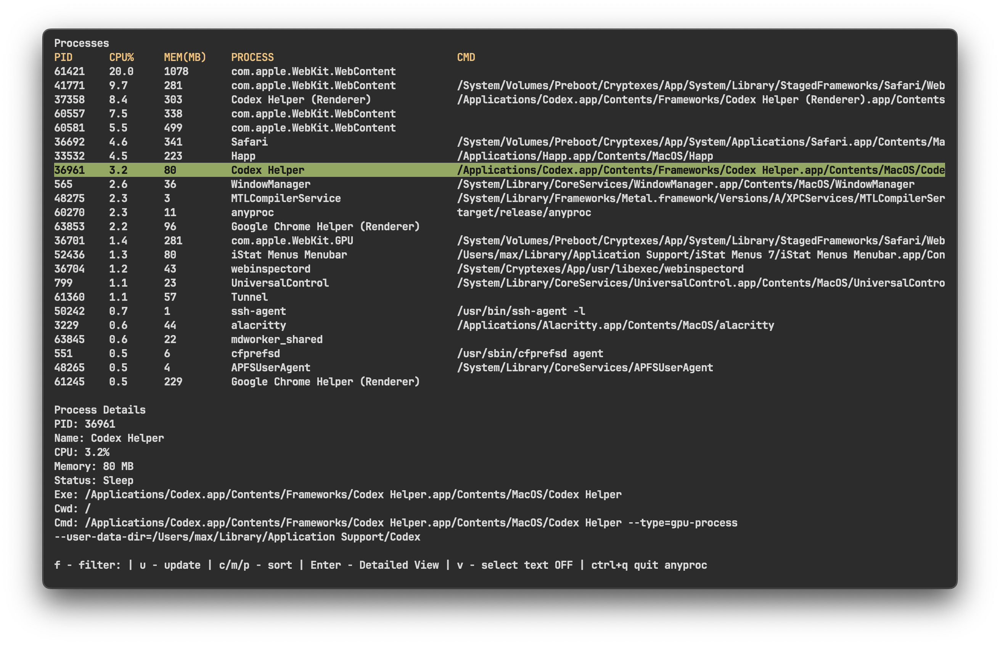

# anyproc

A lightweight terminal process manager built with Rust (`ratatui` + `crossterm`).



## Features

- Process table with PID, CPU, memory, name, and command
- Sorting by CPU, memory, or PID
- Search/filter by process name and command
- Details panel for the selected process
- Mouse support: scroll, row selection, double click
- Process kill action with double `k`

## Installation

### Quick install from GitHub Releases

```bash
curl -fsSL https://raw.githubusercontent.com/vipmax/anyproc/master/install.sh | sh
```

Optional examples:

```bash
# Install a specific version tag
curl -fsSL https://raw.githubusercontent.com/vipmax/anyproc/master/install.sh | sh -s -- --version v0.1.0

# Install to a custom directory
curl -fsSL https://raw.githubusercontent.com/vipmax/anyproc/master/install.sh | sh -s -- --prefix ~/.local/bin
```

### Build from source

```bash
git clone https://github.com/vipmax/anyproc.git
cd anyproc
cargo build --release
./target/release/anyproc
```

## Keybindings

- `q` or `Ctrl+Q`: quit
- `↑` / `↓`: move through the process list
- `Enter`: select a process and open details
- `Esc`: clear selection
- `f`: open filter input mode
- `u`: refresh process list
- `c`: sort by CPU
- `m`: sort by memory
- `p`: sort by PID
- `v`: toggle text selection mode
- double `k` (quick): send `SIGKILL` to selected/focused process

Filter input mode:

- `Enter` / `Esc`: exit input mode
- `←` / `→`, `Home`, `End`: cursor navigation
- `Backspace`, `Delete`: edit filter text

## Development

```bash
cargo check
cargo run
```

## CI/CD

- `.github/workflows/build.yml`: build on push/PR to `main`
- `.github/workflows/release.yml`: release on `v*` tags (Linux musl + macOS universal)
